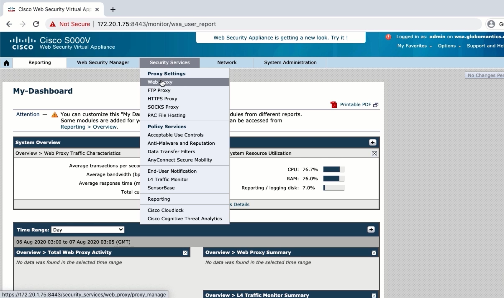
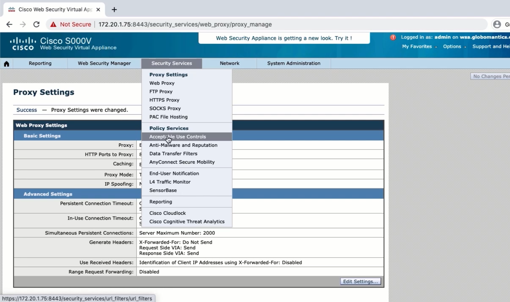
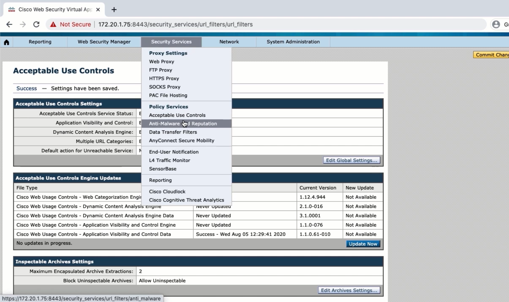
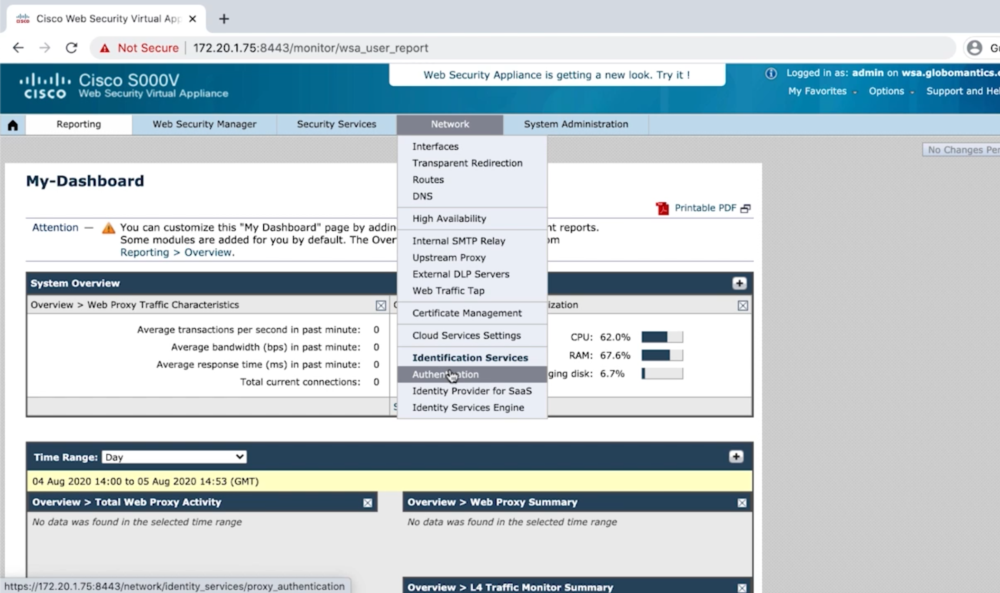
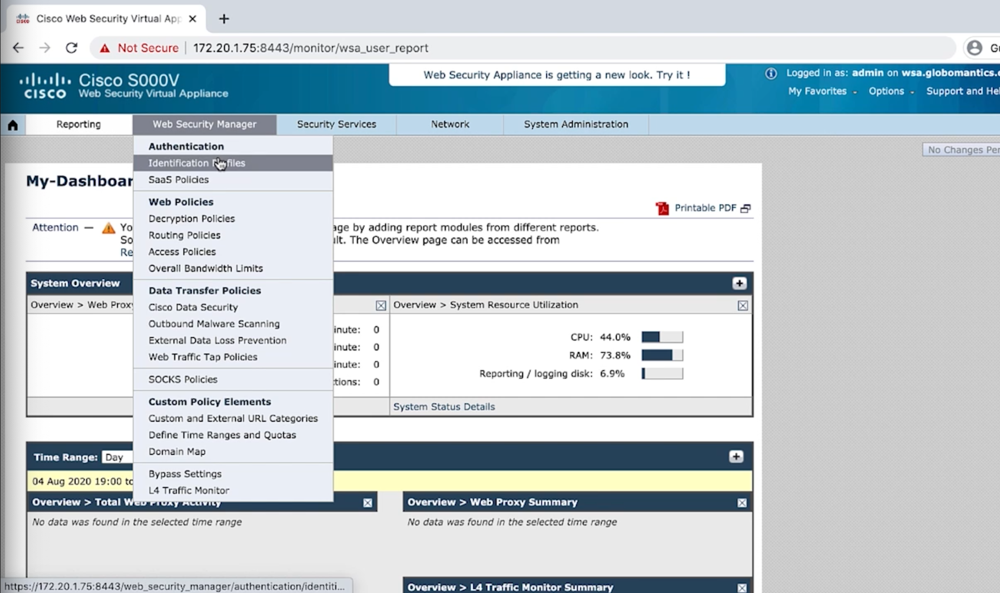

# 2. Deploying the Web Security Appliance

## Different Deployment Modes for the WSA

### Explicit Forward Mode

* Endpoint explicitly configured to use WSA
* Can use PAC file to configure machine

### Transparent Mode

* WCCP configured
* Policy Based Routing or a L4-7 device can also be used to redirect traffic

## Licensing and Initial Setup of the WSA

```
interfaceconfig
setgateway
commit
```

## Finishing the Setup Using the GUI








## Integrating the WSA with Active Directory



## Configuring Identification Profiles

### Identification Profiles

* WSA imposes policies based off of various criteria
* Policies can use user/group information, subnet, and proxy ports
* Different identification profiles can be used for different policies


