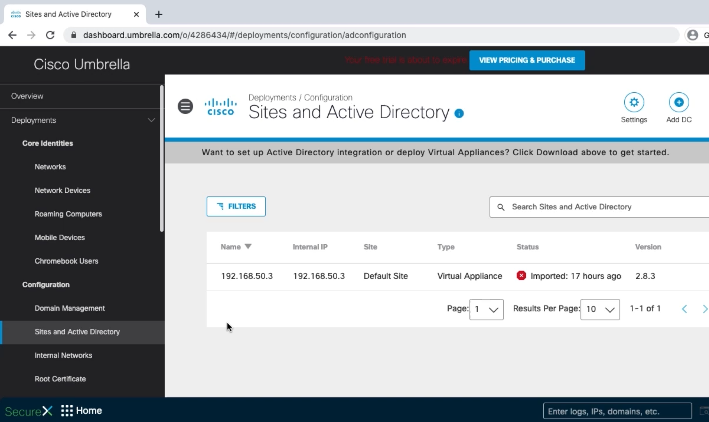
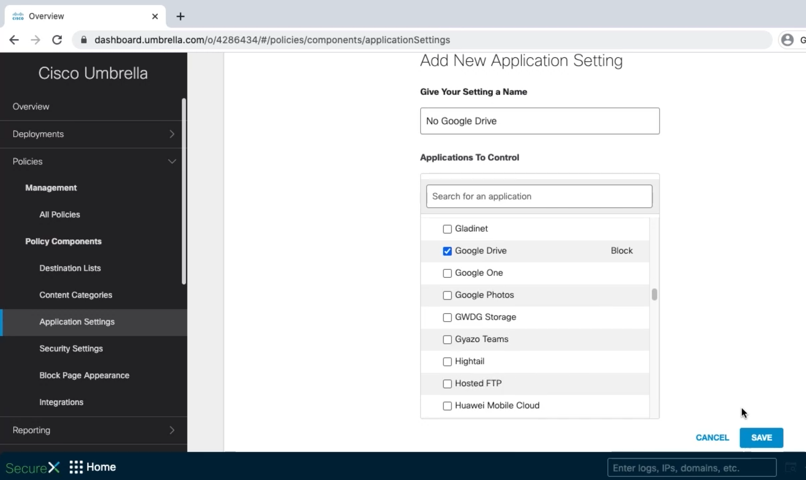
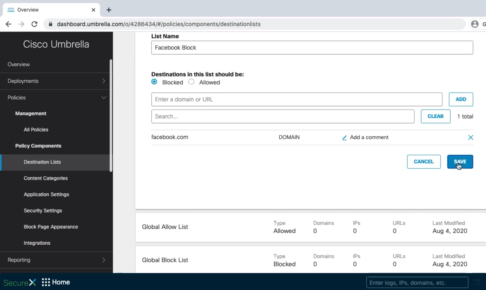
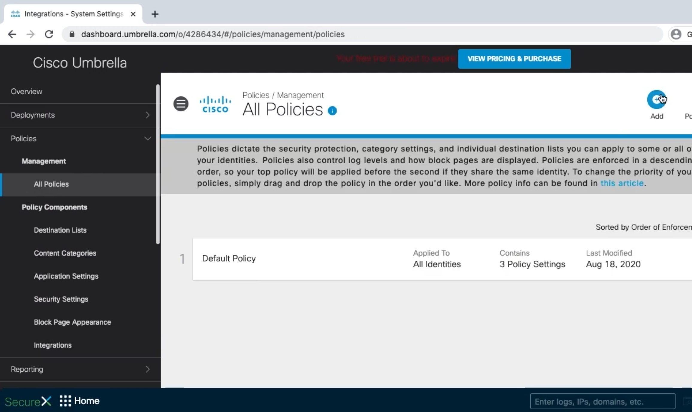
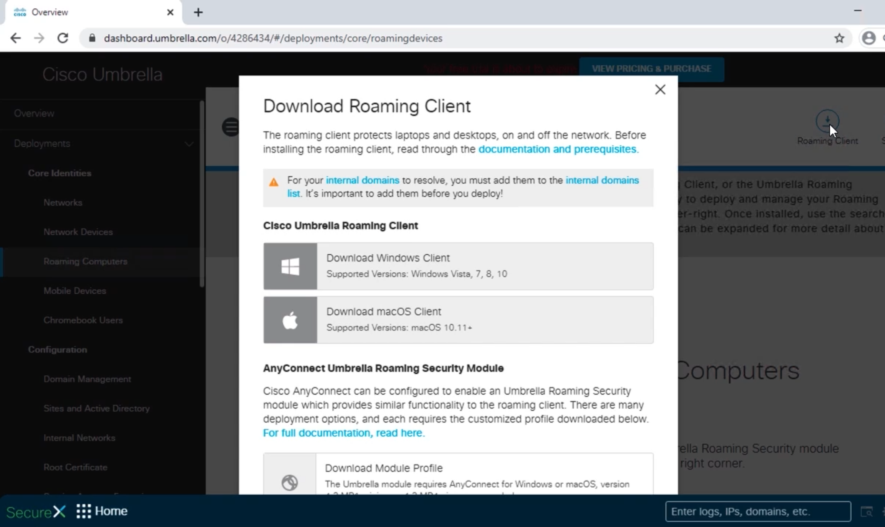
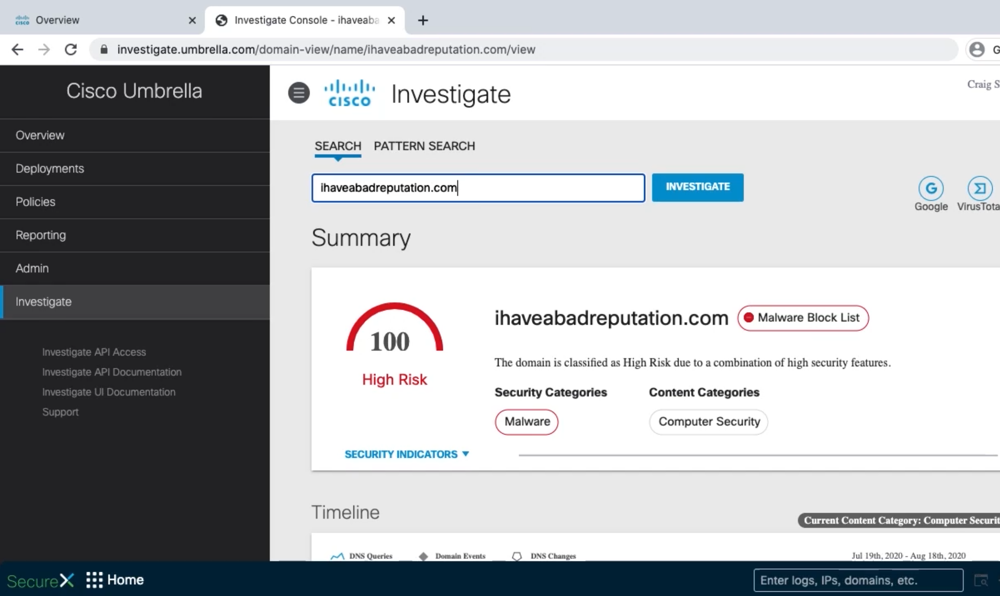

# 5. Deploying Cisco Umbrella

## Configuring Networks to Use Cisco Umbrella

* Umbrella virtual machine forwarder
* DHCP
* Add public IPs to Umbrella
* Add internal networks to Umbrella


```text
config va localdns 172.20.1.5
exit
```



## Creating Policies in Cisco Umbrella

* Create policy components
* Create a policy







## Cisco Umbrella Roaming Computer Profiles

* Configure DNS and verify IP address
* Download and install roaming client
* Update proxy
* Verify



## Cisco Umbrella Investigate



