# 5. Configuring Cisco AnyConnect on the ASA

## Uploading the AnyConnect Client to the ASA

## Adding the ASA to the PKI Infrastructure

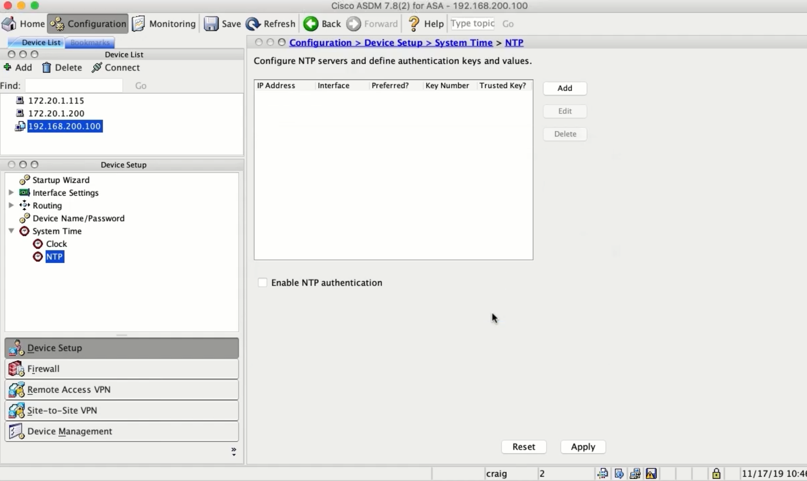

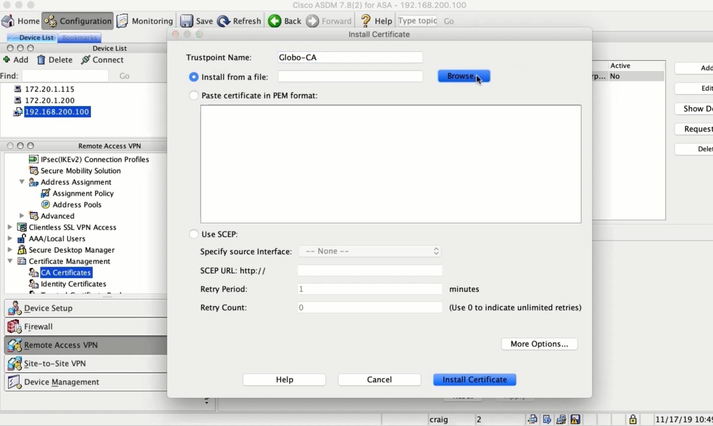

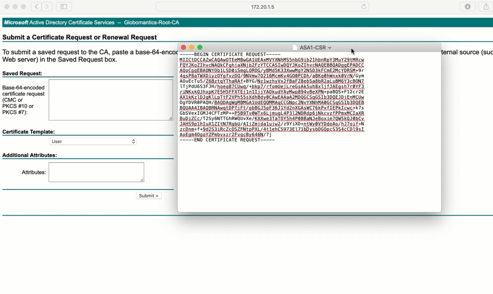

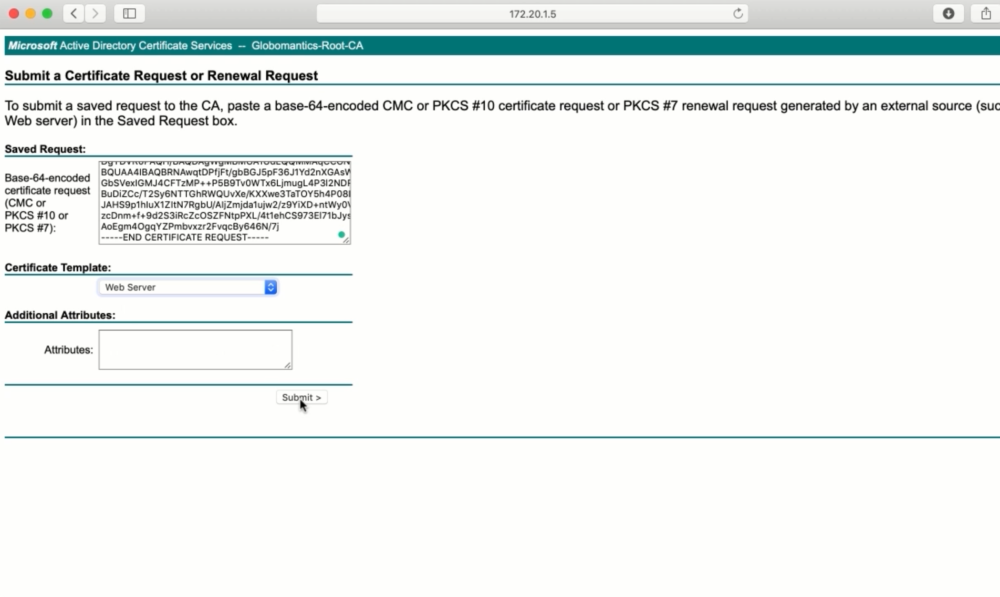

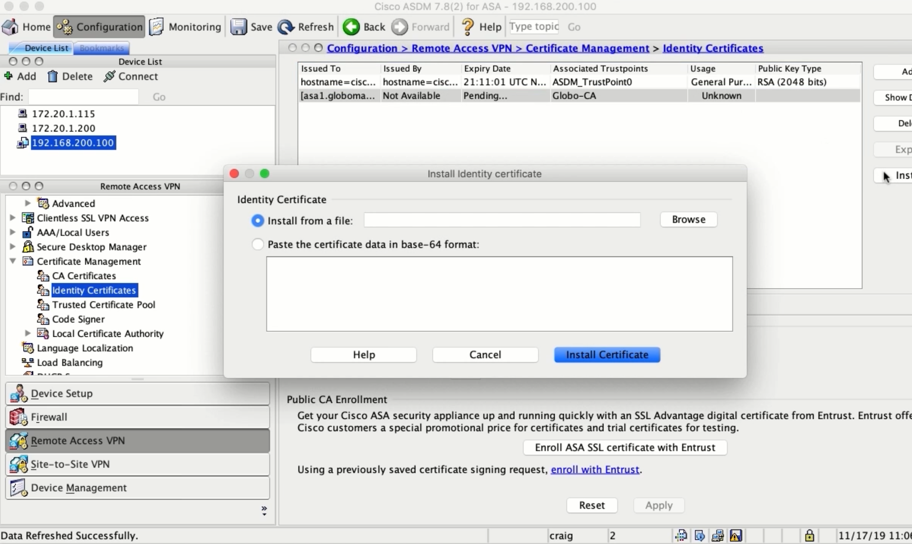

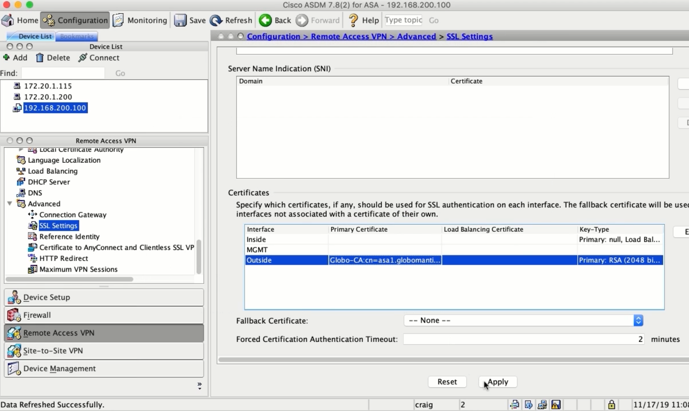

## Creating IP Pools and NoNAT Rules

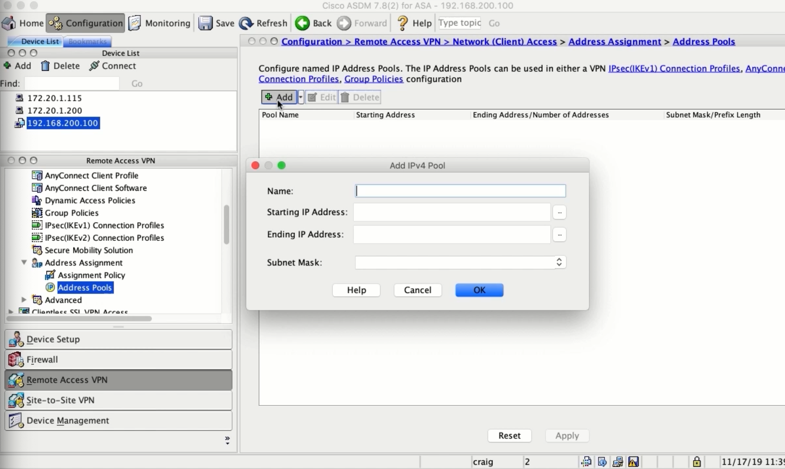

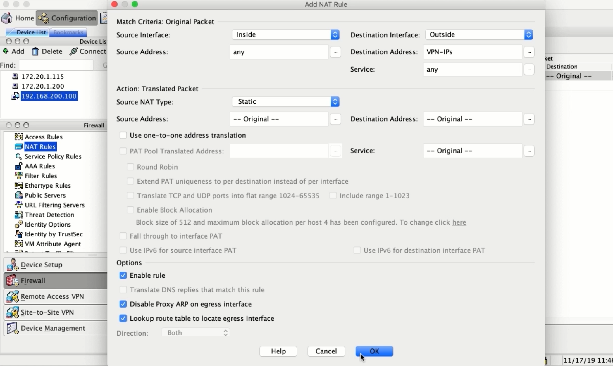

## Integrating the ASA with Active Directory

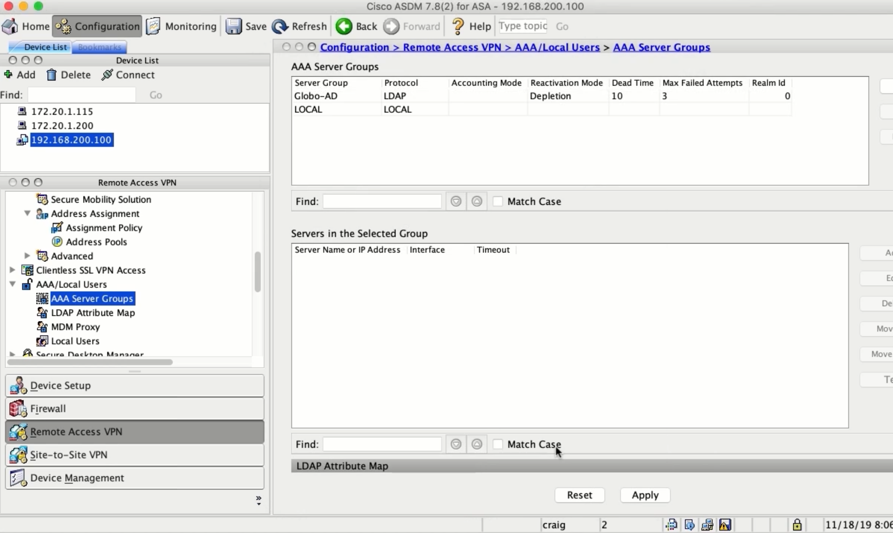

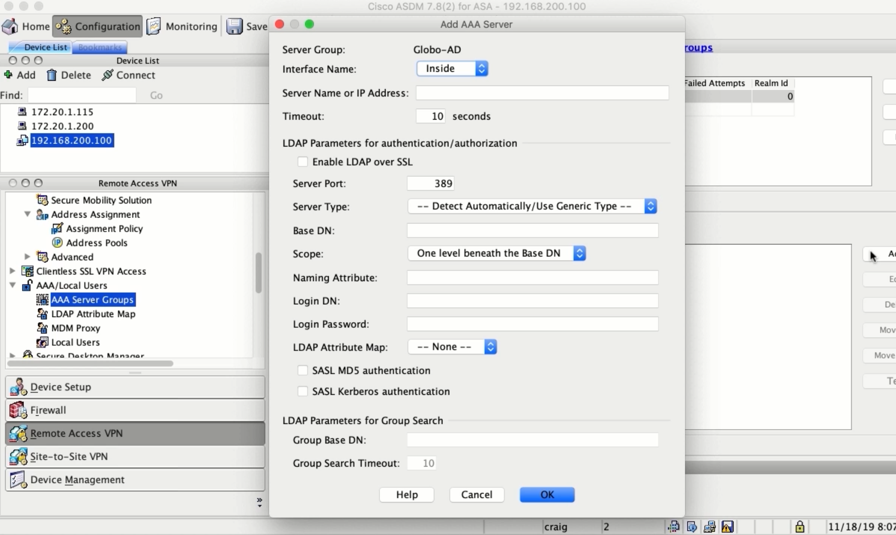

## Policy Hierarchy and Configuring Dynamic Access Policies

### The Ways Settings are Configured

* VPN Connection Profile
* User Profile Policy
* Dynamic Access Policy
* Group Policy

### Settings Priority

1. Dynamic Access Policy
2. User Profile Policy
3. User Profile Specified Group Policy
4. Conn. Profile Specified Group Policy
5. Default Group Policy

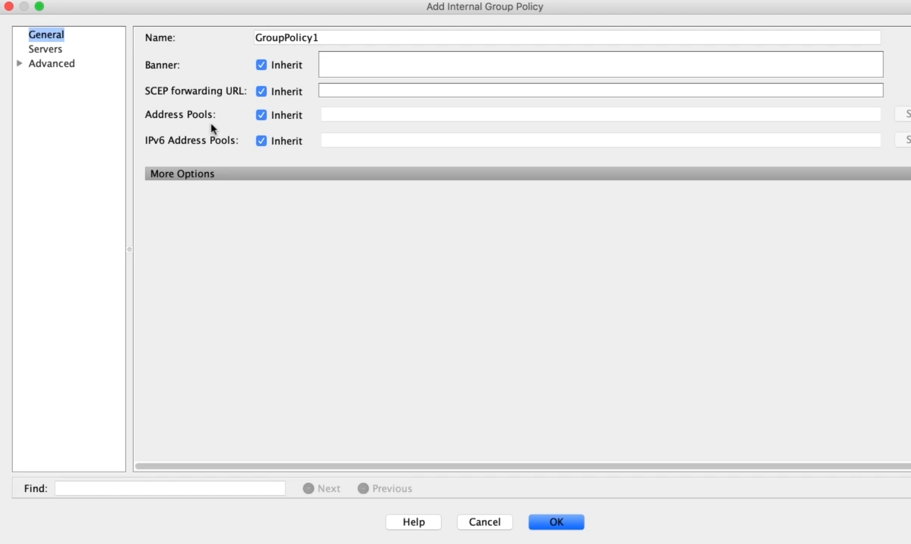

## Configuring Group Policies

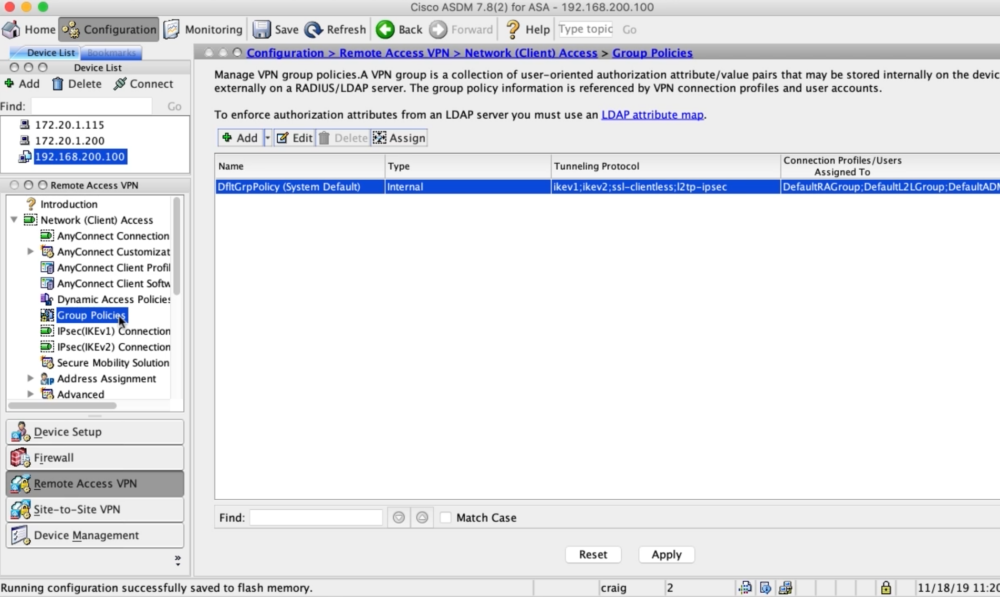

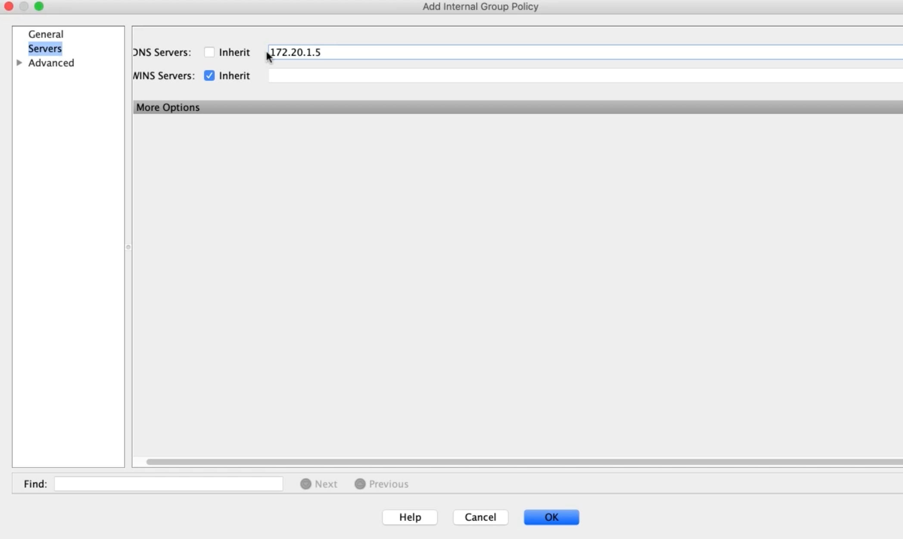

## Configuring Connection Profiles

