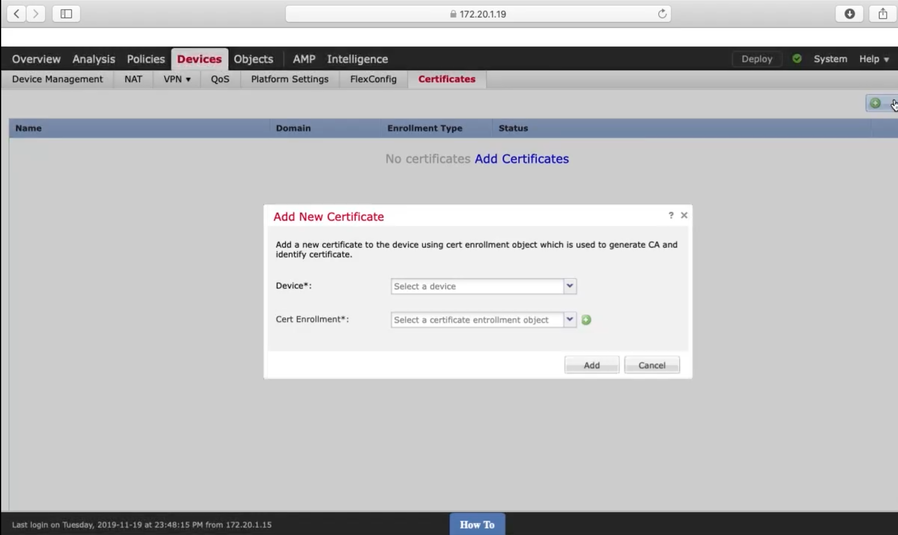

# 6. Configuring Cisco AnyConnect on the FTD

## Integrating Active Directory with the FTD

## Installing an Identity Cert on the FTD

## Configuring a Remote Access Connection Profile on a Cisco FTD

## Configuring a NAT Exemption and ACL Rules for VPN User Traffic

