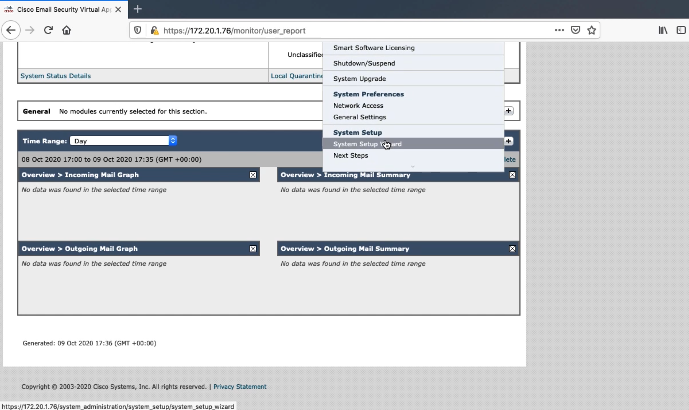
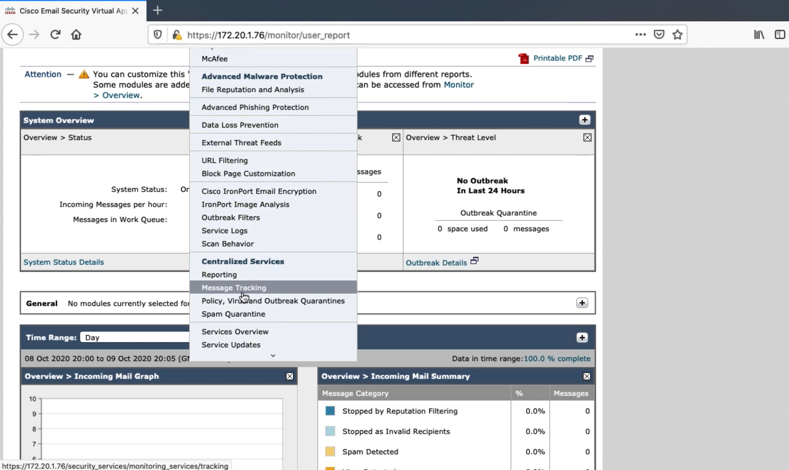
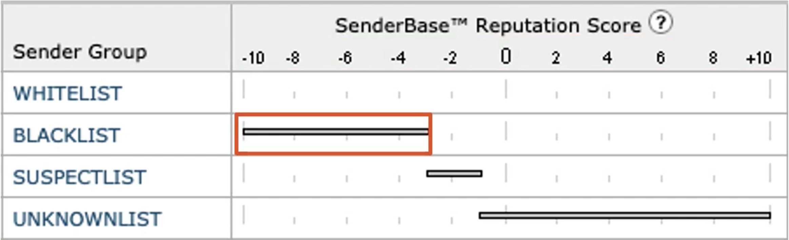
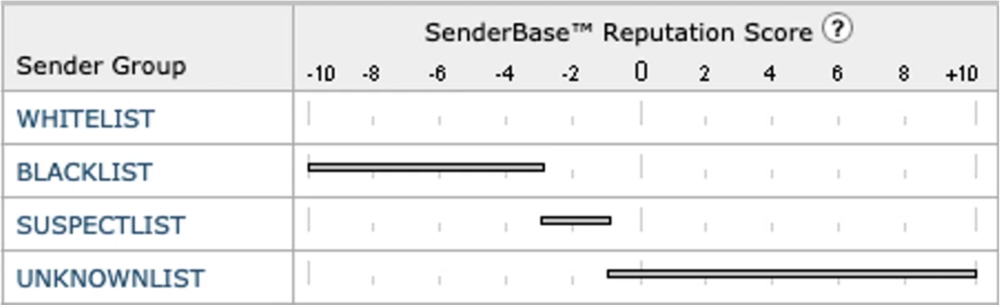
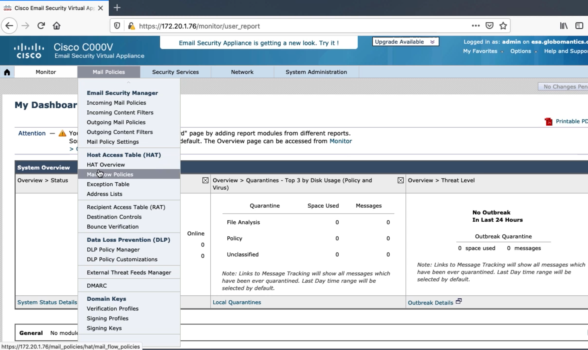
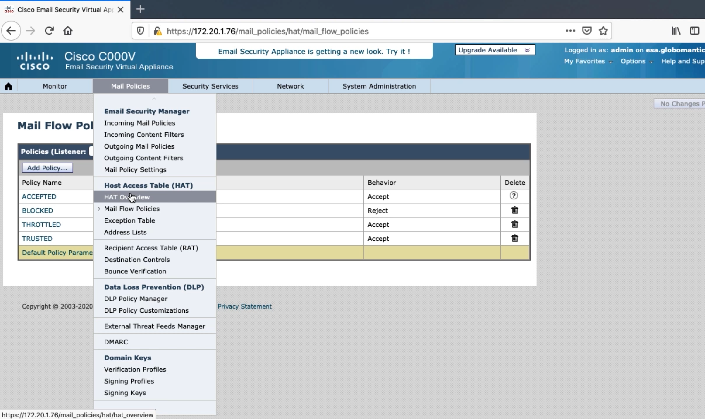
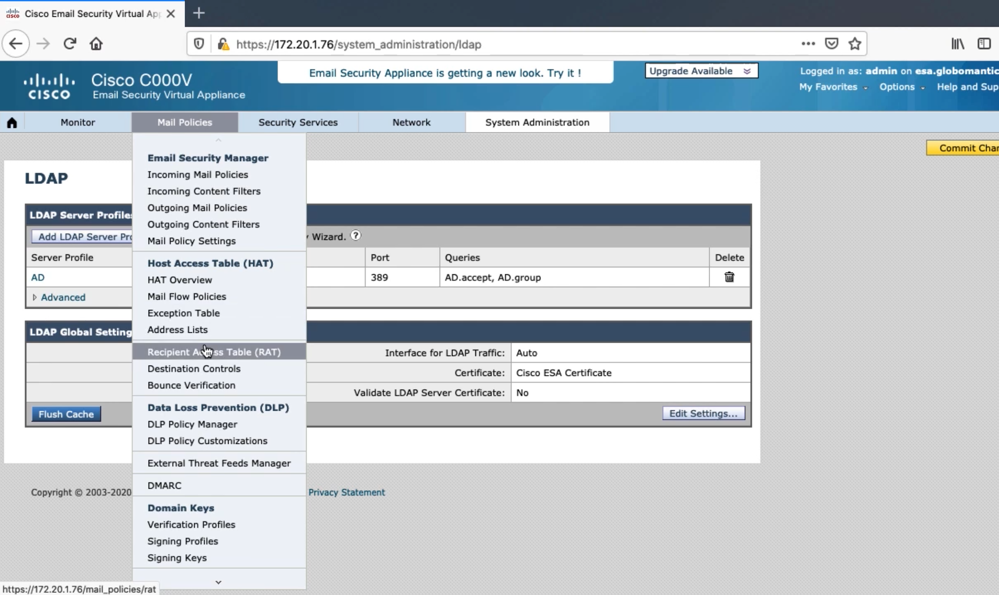

# 2. Configuring the ESA to Accept Email

## Configuring Interfaces to Send and Receive Email





## Listeners and Host Access Tables

### Listeners

Listeners listen on the specified SMTP port for SMTP traffic

* Public Listener
  * Receives emails that are from other organizations with your org as the recipient
  * Public listener will only accept emails if the recipient domain is explicitly defined
* Private Listener
  * Receives emails that are from your org with outside organizations as the recipient





* Cisco sees over 300 billion emails daily
* Determine the likely hood that a sender is malicious or legitimate
  * IP Address of mail server
  * Reverse DNS lookup
  * Determine network owner
  * Organization controlling mail servers should be using IP space

## SMTP Deep Dive

### SMTP 3-Digit Codes

* 2 - Success - received, accepted and understood by the server
* 3 - Redirection - more information is required
* 4 - Temporary failure failure should be easily resolved
* 5 - Permanent failure - failure is unlikely to be resolved

### SMTP Envelope

```text
<< 220 email.carvedrock.com SMTP
>> HELO email.globomantics.com
<< 250 email.carvedrock.com
>> MAIL FROM <kinda@globomantics.com>
<< 250 sender kinda@globomantics.com> ok
>> RCPT TO: <angie@carvedrock.com>
<< 250 recipient <angie@carvedrock.com> ok
```

### SMTP Headers

```text
>> DATA
<< 354 go ahead
>> From: kinda <kinda@globomantics.com>
>> To: angie<angie@carvedrock.com>
>> Subject: Hello?
>> Date tue, 8 October 2019 21:28:30 -0800
```

X-headers can be used to send additional information in an email, but they are not required

### SMTP Body

```text
>> Pluralsight has some of the best training
>> kinda
<< 250 ok
>> QUIT
<< 221 email.carvedrock.com
```

## Mail Flow Policies

### Mail Flow Policy Behaviors

* Relay - Used to forward outbound emails from Globomantics
  * Relay is the only behavior that does not require an associated Recipient Access Table \(RAT\)
* Accept - Used to accept incoming email from senders
* Reject - SMTP connection is started, but 400 or 500 code is sent
* TCP Refuse - No SMTP connection, sender may continue to try again
* Continue - No definitive action, try to match another sender group





## Integrating the ESA with LDAP and Recipient Access Table Deep Dive

### Integrating ESA with LDAP

* ESA will block emails if the recipient doesn't exist
* Once LDAP is configured, by default all recipients will be verified




Place the more specific condition at the top, so it is matched before a more generalized condition

