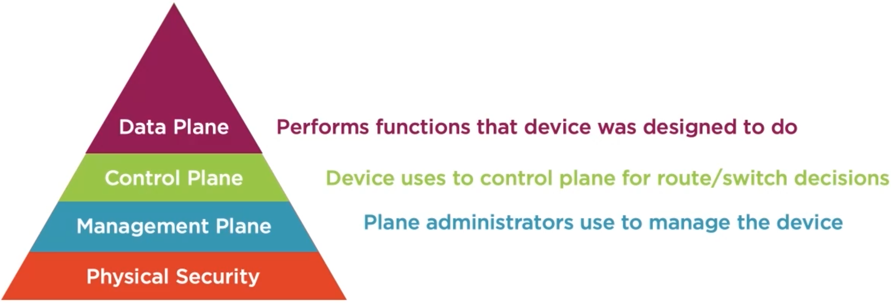

# 3. Securing the Management Plane

## Secure Planes

### Physical Security

* One of the most important things to consider
* Configurations to secure device be undone if anyone has access to device
* Boot into ROMmon
* Could just as easily power off device
  * Cut cables

### Network Device Planes

## Telnet, HTTP, SSH, and HTTPs

### How Do You Manage a Device?

* Console
* Telnet
* HTTP
* Without encryption, data can be compromised

## AAA

TACACS+ & RADIUS are used for AAA

### Managing Administrators

* Create users, passwords, and permissions on each device
  * Doesn't scale
* AAA

  Authentication, Authorization & Accounting

### AAA Process

* Provide security guard with identification \(Guard authenticates you\)
* Verify that the proper forms and approvals have been met \(Guard authorizes you\)
* Logbook and camera track movements and activities \(Accounting record\)

## RADIUS & TACACS+

### RADIUS

* Remote Authentication Dial-in User Service
* Users would dial office modem
* Radius used for authentication
* UDP Ports 1812 & 1813
* Password field is encrypted

**Authentication Protocols:**

* Challenge Handshake Authentication Protocol \(CHAP\)
* Password Authentication Protocol \(PAP\)
* Microsoft CHAP \(MS-CHAP\)
* Extensible Authentication Protocol \(EAP\)

**RADIUS Messages:**

* Access-Accept
* Access-Reject
* Access-Challenge
* Accounting-Request
* Accounting-Response

### TACACS+

* Terminal Access Controller Access Control System
* Does not include authorization in authentication request
* Start message
* Reply asking for username
* Continue with username
* Reply asking for password
* Continue with password
* Reply with authentication determination
* TCP port 49
* Entire payload is encrypted

**Authorization Messages:**

* AAA Client starts with a new conversation for authentication
* Occurs each time user tries to do anything
* Send a request message
* Server Responds with:
  * FAIL
  * PASS\_ADD
  * PASS\_REPL
  * FOLLOW
  * ERROR

**Accounting Messages:**

* Request
* Response

### When Do You Use TACACS+?

* Use to authorize IT employees
  * Have different command sets per different IT levels
  * Each command set would verify with AAA server that the user is authorized
  * Continue checking authorization for each command

### When Do You Use RADIUS?

* User access to the network
* 802.1X
* Change of Authorization \(CoA\)
* Cisco ISE

## SNMP

### SNMP Benefits

* Audit trail
* Immediately alerted of issues
* Events are stored in MIB
* Changes can be made by SNMP server

### SNMPv1 & SNMPv2c

* Community strings
  * all info is in plain text
* At a minimum change default community
  * Too many orgs leave the default
  * Easy attack

### SNMPv3 Configuration

* noAuthnoPriv
  * Similar to SNMPv1 and SNMPv2c - not secure
* AuthNoPriv
  * Username and HMAC password
* AuthPriv
  * Username, HMAC password, & encryption - most secure
* SNMP users are tied to SNMP groups
* SNMP groups can be restricted to only see certain info from MIB

## Additional Protocol Security

### Securely Transferring Files

* Secure File Transfer Protocol \(SFTP\)
  * Secure version of FTP
  * Uses SSH framework to provide security
* Requires secure algorithms!
* Secure Copy Protocol \(SCP\)
  * Also uses SSH to secure traffic
  * Also relies on secure algorithms

### Syslog

* Logs created for events
* SIEM correlates logs and finds anomalies
* Syslog messages aren't secure
* Theres now Secure Syslog
* Using TLS

### Network Time Protocol

* Proper time allows logs and SNMP messages to be correlated
* Some industries require precision time in orter to function
* Not traditionally secured - easily attacked
* DoS attacks & disrupting business activities
* Use NTP authentication

### DNS

* Registrar hijacking
  * Attacker hacks into organizations DNS account
* DNS Cache Poisoning
  * Attacker sends false DNS records to DNS server
* Can point DNS records to malicious server to cause DoS or gain data

### Cisco Discovery Protocol

* Learn which devices are connected
* IP Address, device model, VLANs, etc.
* Info can be used by attacker
  * Reconnaissance
* Disable CDP on untrusted interfaces

## Management Plane ACLs

* Controls which IPs and protocols access management plane
* Permit and deny traffic based on srs/dst IPs and ports
* Deny insecure protocols
* Allow ssh and https from management IPs
* Permit mgmt. protocols to/from management servers
* Apply ACL to mgmt. plane

