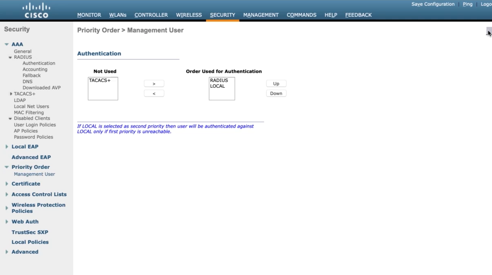
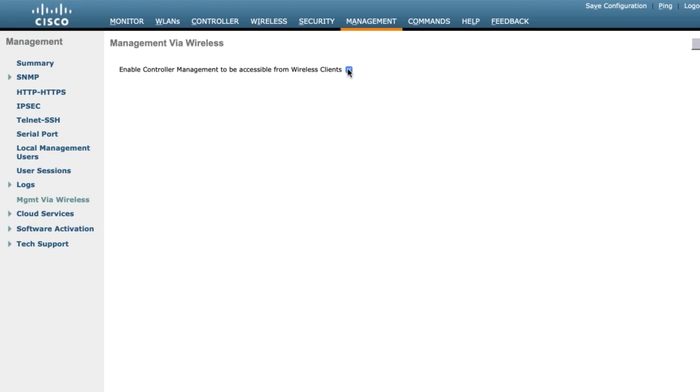
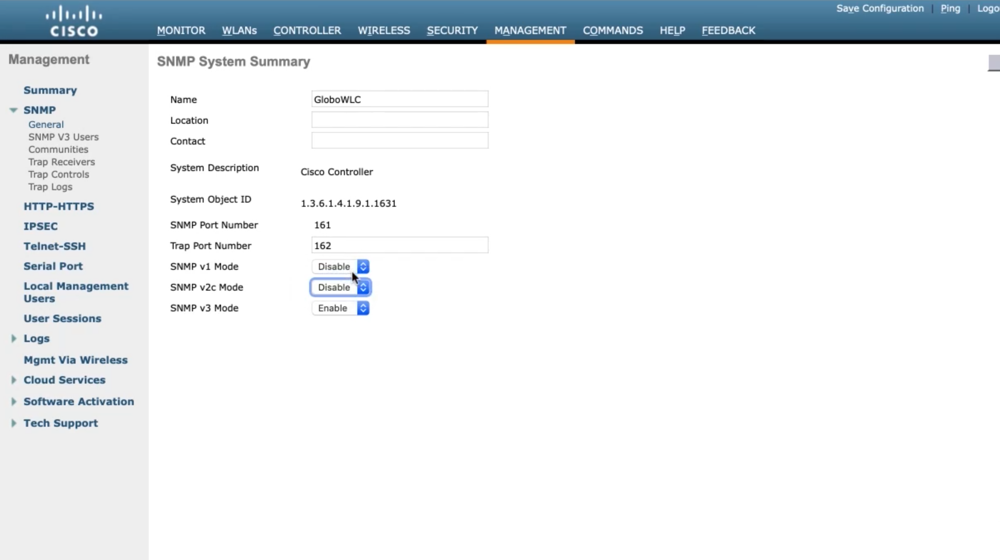
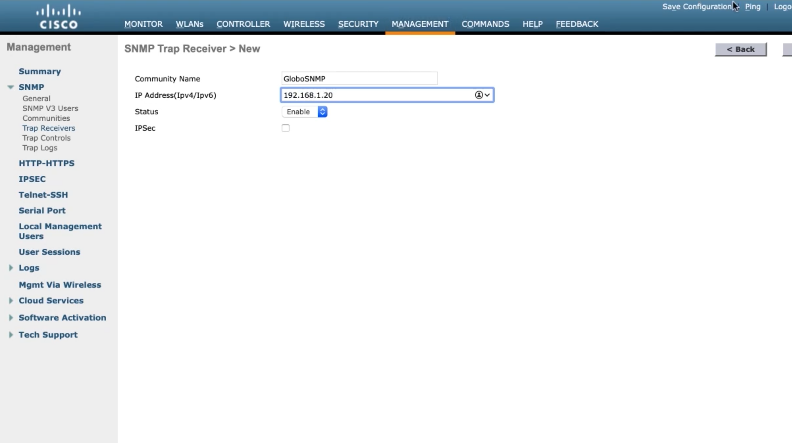
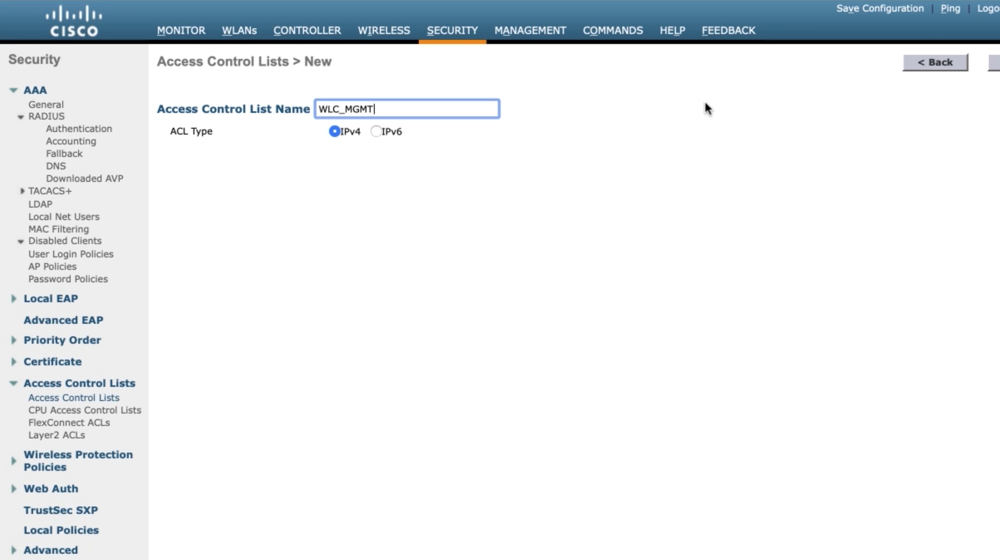
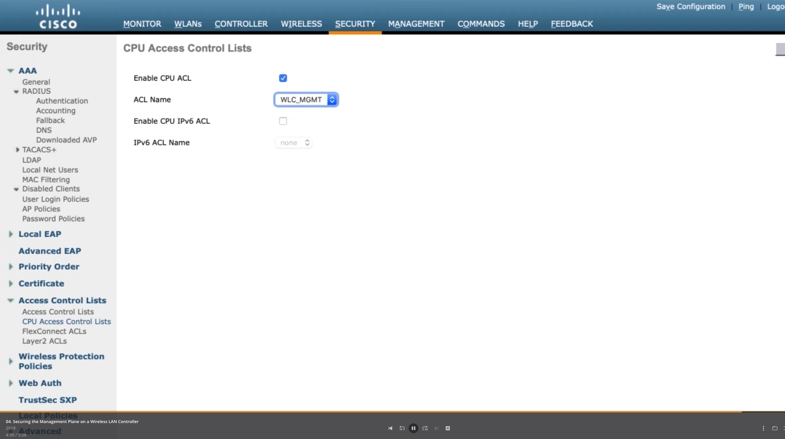

# 6. Configuring Wireless LAN Controller Device Hardening Methods

## Wireless Security Overview

### Why Wireless Security Is Needed

* Malicious attacker doesn't need physical access to cable
* Can listen if they are within distance of wireless signal
* Additional security measures are needed

### Wired Equivalent Privacy \(WEP\)

* Password required before device allowed on network
* 24 bit initialization vector \(IV and RC4
* IV was too short and insecure

### Wifi Protected Access \(WPA\)

* 48-bit IV & TKIP
* Message Integrity Check
* Sequence counter

### WPA2

* IEEE 802.11i
* AES-128 & Cipher Block Chaining Message Authentication Code Protocol \(CCMP\)
* WPA2 Enterprise
  * Uses 802.1X
  * Authentication occurs at AAA server
* WPA2 Personal
  * Use Pre-Shared-Key as authentication

### Adding Encryption to Wireless LANS

### Configuring WPA2 Enterprise

### Securing the Management Plane on a Wireless LAN Controller

