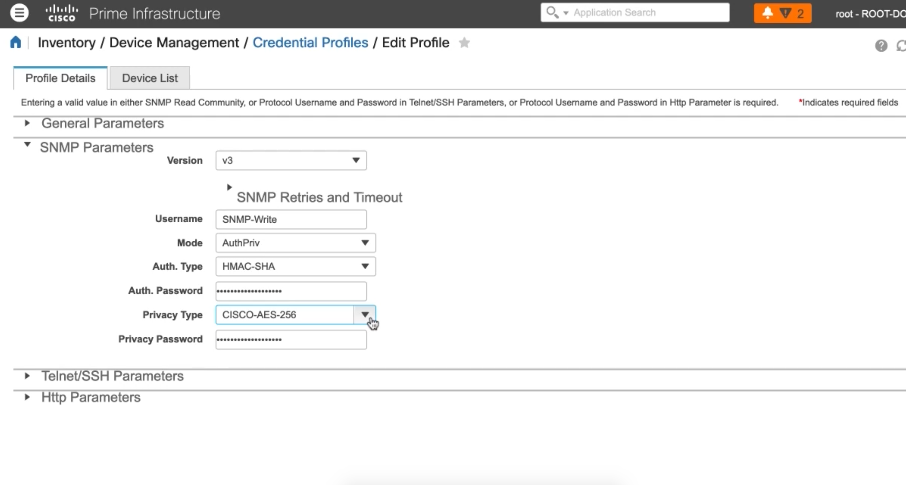
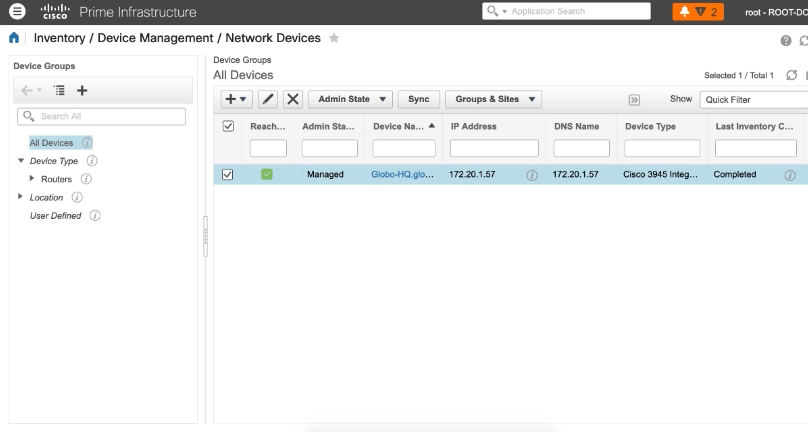

# 3. Configuring Management Protocols on a Cisco IOS Device

## Configuring SNMPv3 Users on a Cisco Router or Switch

### SNMPv3

* SNMP Users
* Defines credentials and algorithms
* SNMP Groups
  * Associates with SNMP Users with SNMP Views
* SNMP Views
  * Defines the information that the SNMP user can access
    * All information is stored in the Management Information Base \(MIB\)
    * Object Identifiers \(OID\) correspond to specific information about a router
    * OIDs are stored in a hierarchical tree. OIDs lower in the tree are included with OIDs above it



```text
Globo-HO(confia)#snmp-server view EVERTHING iso included
Globo-HQ(config)#snmp-server group Write-EVERYTHING v3 priv read EVERYTHING write EVERYTHING
Globo-HQ(config)#snmp-server user SNMP-Write Write-EVERYTHING v3 auth sha Globo123 priv aes 256 Globo123
```



## Configuring NTP Authentication

```text
Globo-HQ(config)#ntp server vrf Mgmt-intf 172.20.1.51
Globo-HQ(config)#ntp authentication-key 1 md5 Globo123
Globo-HQ(config)#ntp trusted-key 1
Globo-HQ(config)#ntp authenticate
Globo-HQ(config)#ntp server vrf Mgmt-intf 172.20.1.51 key 1
Globo-HQ(config)#do show ntp associations detail
```

## Securing CDP on a Cisco Router or Switch

```text
Globo-Core#show cdp neigh
Globo-Core#show cdp neigh gi 0/1 detail
Globo-HQ(config)#no cdp run
Globo-HQ(config)#cdp run
Globo-HQ(config)#int gi 0/1
Globo-HQ(config-if)#no cdp enable
Globo-HQ(config-if)#cdp enable
Globo-HQ(config-if)#exit
Globo-HQ(config)#cdp tlv-list Mgmt-Only
Globo-HQ(config-tlv-list)#address
Globo-HQ(config-tlv-list)#capability
Globo-HQ(config-tlv-list)#cos
Globo-HQ(config-tlv-list)#duplex
Globo-HQ(config-tlv-list)#ext-port
Globo-HQ(config-tlv-list)#hell
Globo-HQ(config-tlv-list)#ip
Globo-HQ(config-tlv-list)#nativ
Globo-HQ(config-tlv-list)#plat
Globo-HQ(config-tlv-list)#port
Globo-HQ(config-tlv-list)#power
Globo-HQ(config-tlv-list)#powernet
Globo-HQ(config-tlv-list)#spare-
Globo-HQ(config-tlv-list)#trust
Globo-HQ(config-tlv-list)#version
Globo-HQ(config-tlv-list)#vtp
Globo-HQ(config-tlv-list)#vvid
Globo-HQ(config)#int gi 0/1
Globo-HQ(config-if)#cdp filter-tlv-list Mgmt-Only
Globo-Core#clear cdp table
Globo-Core#show cdp neigh
Globo-Core#show cdp neigh gi 0/1 detail

Device  ID: Globo-HQ.globomantics.com
Entry address(es):
Interface: GigabitEthernet0/1
Holdtime 135 sec

advertisement version: 2
Management address(es):
  IP address: 172.20.1.57

Total cdp entries displayed 1
```

## Using SCP to Transfer Files

Globo-HQ\(config\)\#ip ssh source-interface gig 0/1 Globo-HQ\(config\)\#exit Globo-HQ\#dir Globo-HQ\#copy startup-config scp: Address or name of remote host \[\]? 172.20.1.15 Destination username \[caleb\]? Destination filename \[globo-hq-confg\]? Writing globo-hq-confg Password:

## Configuring DHCP and DNS on an IOS Device

```text
Globo-Core(config)#int vlan 172
Globo-Core(config-if)#ip add 172.20.1.189 255.255.255.0
Globo-Core(config-if)#no shut
Globo-Core(config-if)#exit
Globo-Core(config)#ip dhcp excluded-address 172.20.1.1 172.20.1.200
Globo-Core(config)#ip dhcp excluded-address 172.20.1.210 172.20.1.255
Globo-Core(config)#ip dhcp pool Mgmt-Hosts
Globo-Core(dhcp-config)#network 172.20.1.0 255.255.255.0
Globo-Core(dhcp-config)#default-router 172.20.1.1
Globo-Core(dhcp-config)#dns-server 172.20.1.57
Globo-Core(dhcp-config)#domain-name globomantics.com
Globo-Core(dhcp-config)#option 150 ip 172.20.1.110
Globo-Core(dhcp-config)#lease 700
Globo-Core(config)#do show ip dhcp binding
Globo-HQ(config)#ip dns server
Globo-HQ(config)#ip domain-lookup
Globo-HQ(config)#ip name-server 8.8.8.8
Globo-HQ(config)#ip host Globo-ISE 172.20.1.55
```

