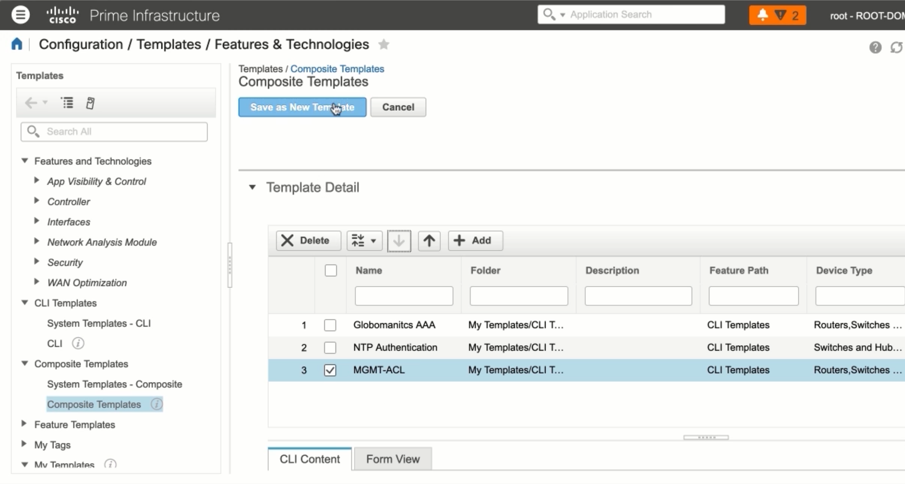

# 4. Managing Cisco IOS Devices with Cisco Prime Infrastructure

## Adding a Device to Cisco Prime Infrastructure


## Using Cisco Prime Infrastructure to Make Changes on IOS Devices


```text
Globo-HQ#show ip int bri
Interface IP-Address 0K? Method Status Protocol
GigabitEthernet0/0 192.168.1.100 YES manual up up
GigabitEthernet0/1 172.20.1.57 YES manual up up
Loopback100 1.1.1.1 YES manual up up
```

## Using Cisco Prime Templates to Make Changes on IOS Devices

**Current config on device:**

```text
Globo-HQ-MPLS#show run sec aaa
aaa new-model
aaa session-id common
```





**Config deployed:**

```text
Globo-HQ-MPLS#show run | sec aaa
aaa new-model
aaa group server tacacs+ GloboISEGroup
server name GloboISE1
ip vrf forwarding Mgmt-intf
ip tacacs source-interface GigabitEthernet0/1
aaa authentication login default group GloboISEGroup local
aaa authentication enable default group GloboISEGroup enable
aaa authorization console
aaa authorization config-commands
aaa authorization exec default group GloboISEGroup local if-authenticated
aaa authorization commands default group GloboISEGroup local if-authenticated
aaa authorization commands default group GloboISEGroup local if-authenticated
aaa authorization commands 4 default group GloboISEGroup local if-authenticated
aaa authorization commands 15 default group GloboISEGroup local if-authenticated
aaa accounting exec default start-stop group GloboISEGroup
aaa accounting commands 0 default start-stop group GloboISEGroup
aaa accounting commands 1 default start-stop group GloboISEGroup
aaa accounting commands 4 default start-stop group GloboISEGroup
aaa accounting commands 15 default start-stop group GloboISEGroup
aaa session-id common
```

## Using Prime to Upgrade IOS Devices

**We want to upgrade this image:**

```text
sh ver
System image file is "flash:c3750e-universalk9-mz.152-4.E6/c3750e-universalk9-mz.152-4.E6.bin"
```


**The image is upgraded:**

```text
sh ver
System image file is "flash:c3750e-universalk9-mz.152-4.E9.bin"
```

