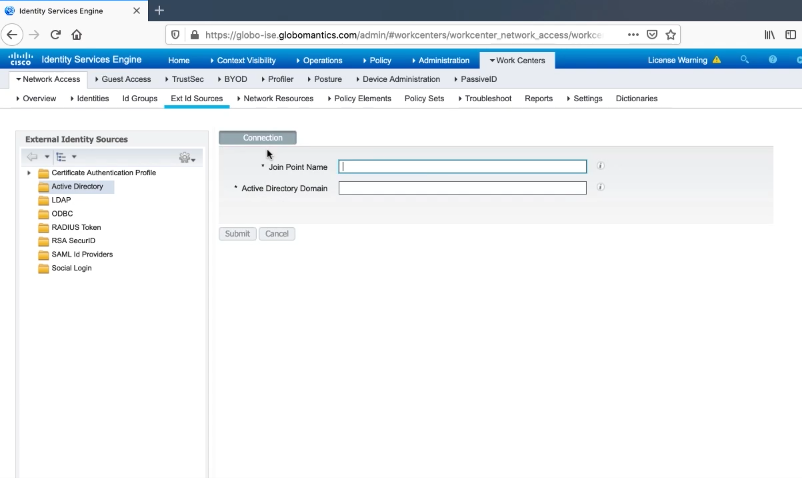

# 2. Configuring Cisco ISE for 802.1X

## Policy Sets, Authentication Policies, and Authorization Policies

### Policy Sets

* Contain authentication and authorization policies
* If-then statements

### Policy Set Logic

* Authorization policy rules are only applied if the device matches the policy set
* Evaluated in a top down fashion
* Use specific policy sets
  * Prevents large, confusing rule-sets

## ISE Identity Sources & Active Directory Integration

## Adding Network Access Devices To ISE

## Creating Authentication Policies In ISE

## Configuring dACLs, Authorization Profiles, and Authorization Policies

