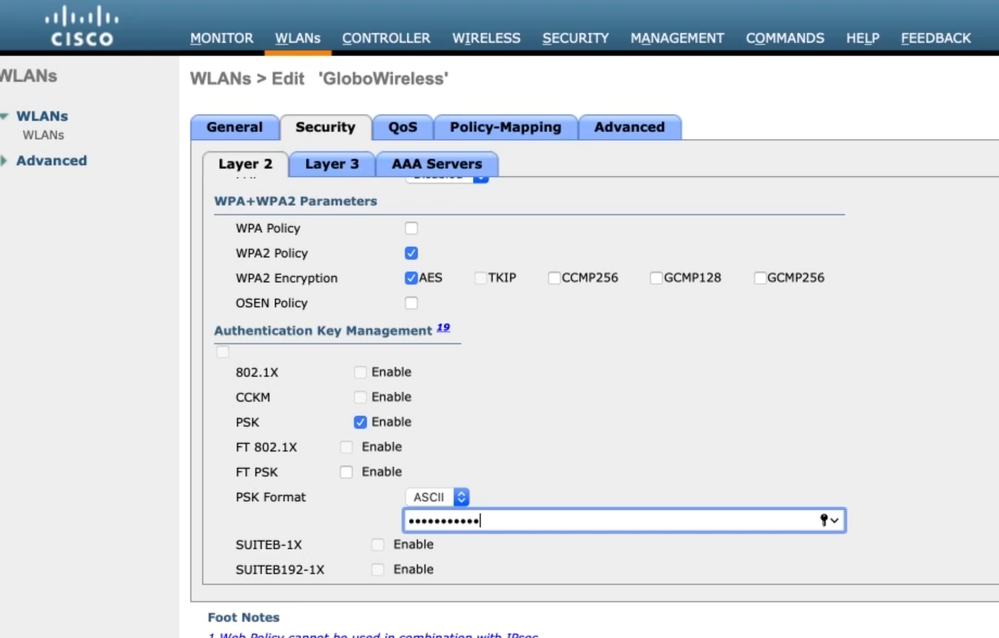
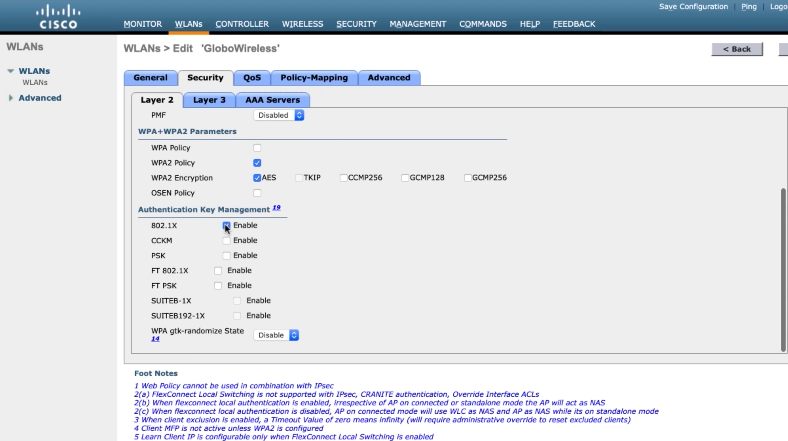
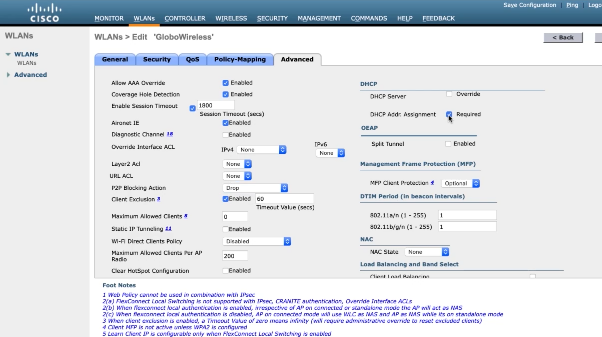
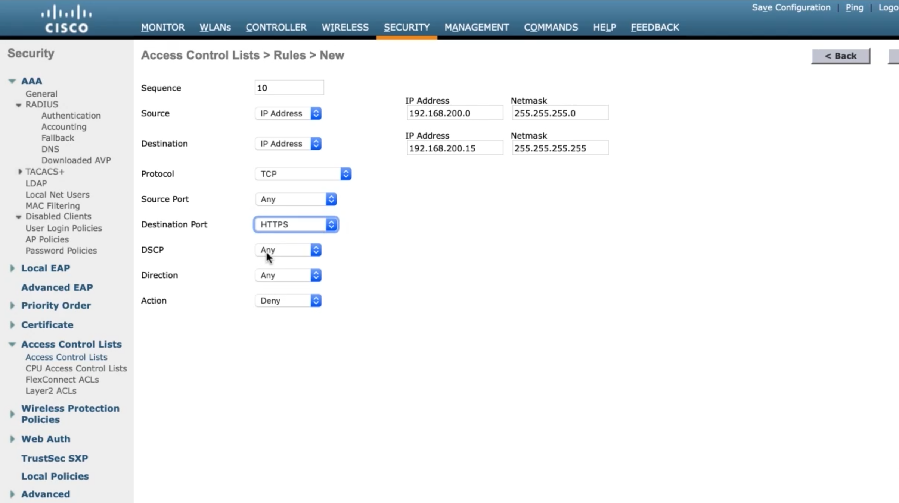
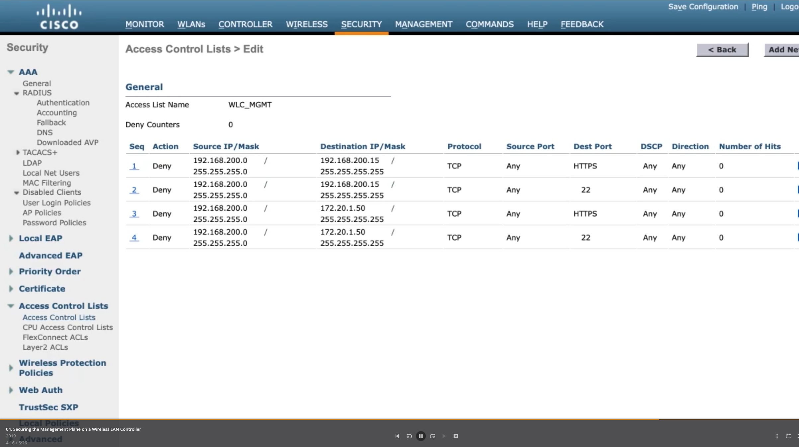

# 06. Configuring Wireless LAN Controller Device Hardening Methods

## Wireless Security Overview

### Why Wireless Security Is Needed

* Malicious attacker doesn't need physical access to cable
* Can listen if they are within distance of wireless signal
* Additional security measures are needed

### Wired Equivalent Privacy (WEP)

* Password required before device allowed on network
* 24 bit initialization vector (IV and RC4
* IV was too short and insecure

### Wifi Protected Access (WPA)
* 48-bit IV & TKIP
* Message Integrity Check
* Sequence counter

### WPA2

* IEEE 802.11i
* AES-128 & Cipher Block Chaining Message Authentication Code Protocol (CCMP)
* WPA2 Enterprise
  * Uses 802.1X
  * Authentication occurs at AAA server
* WPA2 Personal
  * Use Pre-Shared-Key as authentication

### Adding Encryption to Wireless LANS

WLANs > select profile

Security > Layer 2 > WPA+WPA2

PSK > input password

### Configuring WPA2 Enterprise

Security > AAA > RADIUS > Authentication

Input Server IP and Shared Secret

WLANs > select profile > Security > Layer 2 > 802.1X

AAA Servers > Server 1

Advanced > Allow AAA Override, P2P Blocking Action (Drop), DHCP Addr. Assignment (Reguired)

Advanced > NAC State > ISE NAC

Advanced > Radius Client Profiling (enable all), Local Client Profiling (enable all)

### Securing the Management Plane on a Wireless LAN Controller

Security > Priority Order > Management User > move LOCAL down

HTTP-HTTPS

Telnet-SSH

Mgmt Via Wireless

SNMP > General

SNMP > Create User

SNMP > Trap Receivers

Security > Access Control Lists > Access Control Lists > New ...

Add new rule

More rules

Apply ACL to CPU

