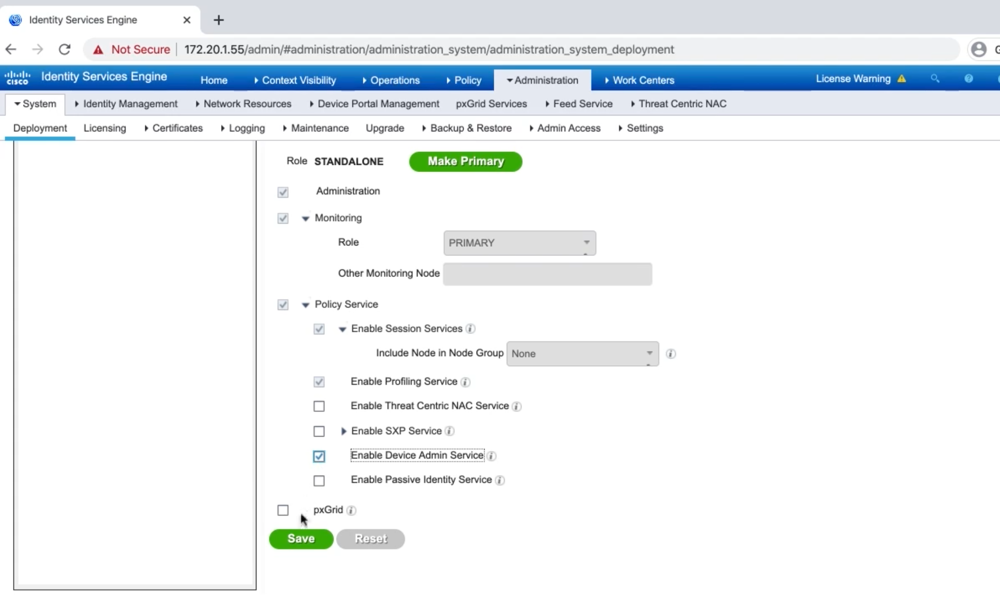
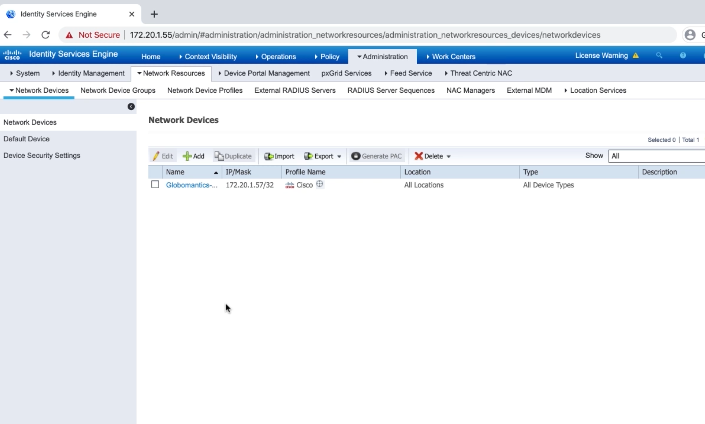
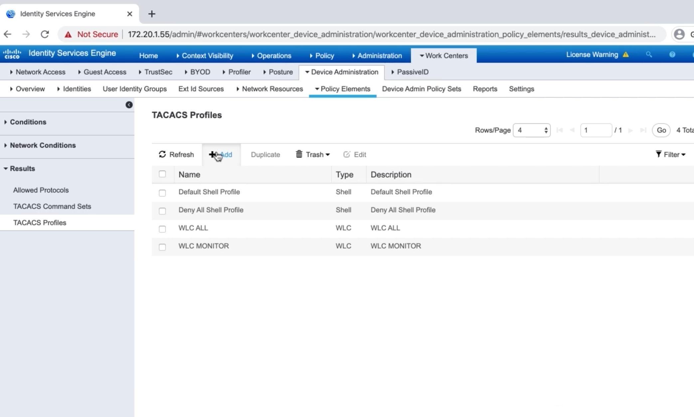
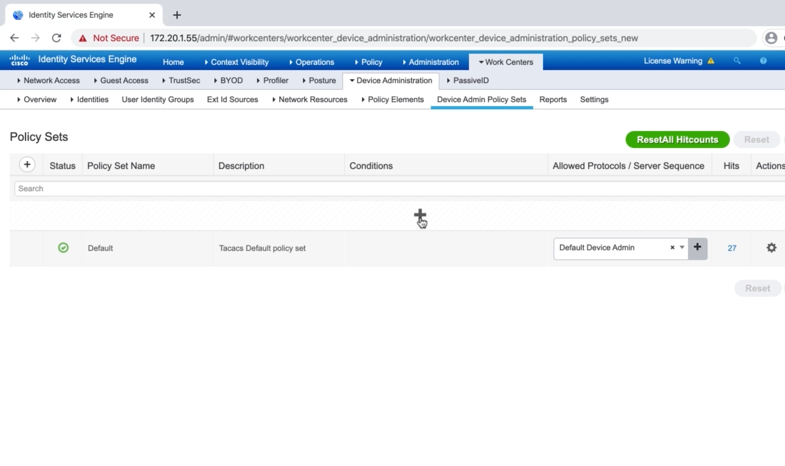

# 2. Configuring AAA on a Cisco ASA For Use with Cisco ISE

## Prepping Cisco ISE to Support TACACS






## TACACS Profiles and TACACS Command Sets




## Configuring Device Admin Policy Sets



## Configuring AAA on an ASA Using the CLI and ASDM

```
Globo-ASA(config)# aaa-server GloboISE protocol tacacs
Globo-ASA(config-aaa-server-group)# aaa-server GloboISE (MGMT) host 172.20.1.55
Globo-ASA(config-aaa-server-host)# key GloboISE123
Globo-ASA(config-aaa-server-host)# exit
Globo-ASA(config)# aaa authentication ssh console GloboISE LOCAL
Globo-ASA(config)# aaa authentication http console GloboISE LOCAL
Globo-ASA(config)# aaa authentication enable console GloboISE LOCAL
Globo-ASA(config)# aaa authentication secure-http-client
Globo-ASA(config)# aaa authorization http console GloboISE
Globo-ASA(config)# aaa authorization command GloboISE LOCAL
Globo-ASA(config)# aaa authorization exec authentication-server auto-enable
Globo-ASA(config)# aaa accounting ssh console GloboISE
Globo-ASA(config)# aaa accounting serial console GloboISE
Globo-ASA(config)# aaa accounting enable console GloboISE
Globo-ASA(config)# aaa accounting command GloboISE
```


