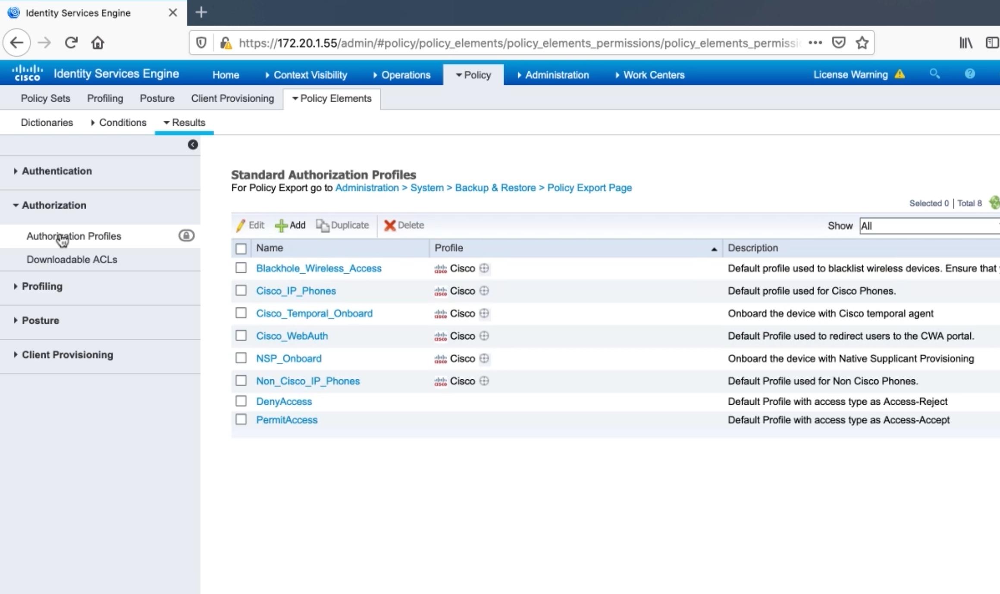

# 2. Configuring AAA on an FTD Appliance for Use with Cisco ISE

## Prepping Cisco ISE to Support RADIUS for Device Administration

## Role-based Access for Firepower Device Manager

* When devices use role-based access to determine privilege, RADIUS must be used as the AAA protocol.
* TACACS should be used when the device configured mainly through CLI, since TACACS allows each command to be authorized.

### Role-based Access Using FDM GUI

Cisco AV Pairs:
* Read-Only (`fdm.userrole.authority.ro`)
* Read-Write (`fdm.userrole.authority.rw`)
* Admin (`fdm.userrole.authority.admin`)

### Role-based Access Using FDM CLI

Service Types:
* Read-Only (`Service-Type:Administrator(6)`)
* Read-Write (`Service-Type:NAS Prompt(7)`)

## Configuring RADIUS Authorization Profiles for Device Administration on Cisco ISE

## Configuring RADIUS Policy Sets for Device Administration Using RADIUS

## Configure Firepower to Use ISE as RADIUS Server for Device Administration

