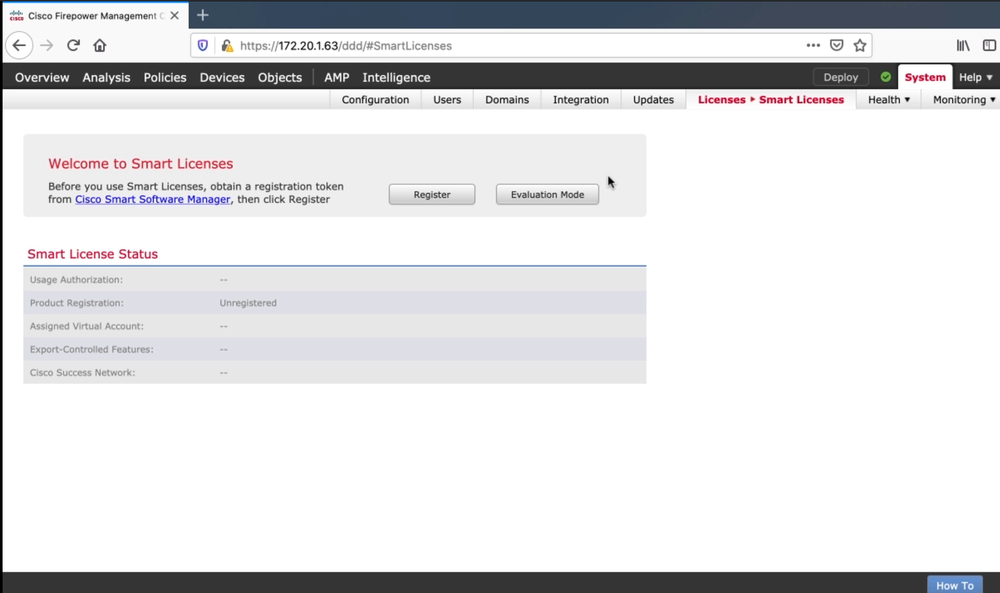
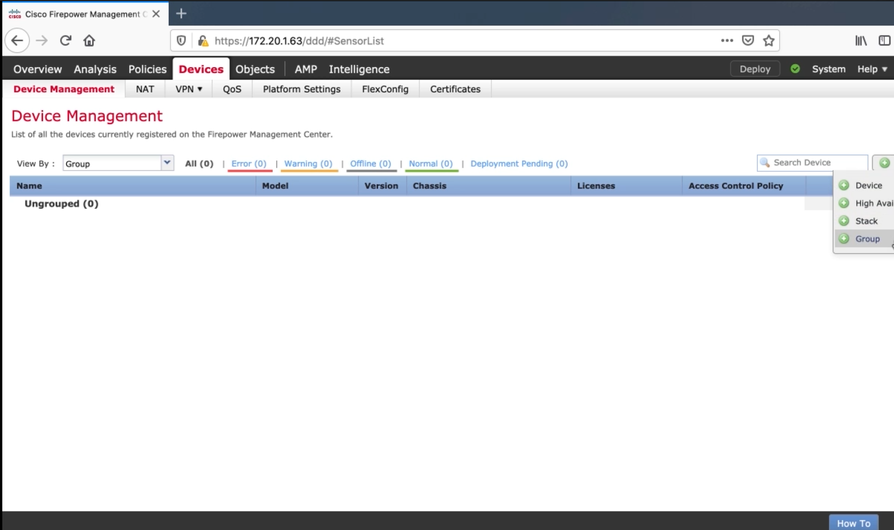
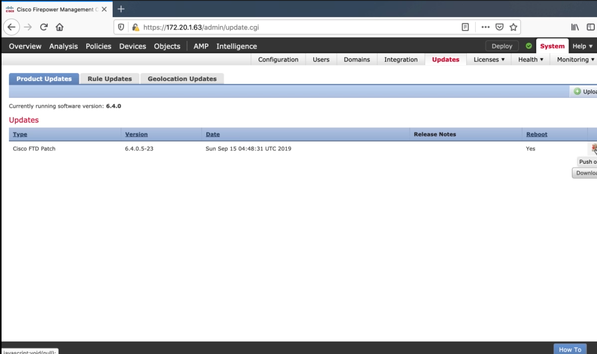

# 4. Managing Multiple Firepowers with Cisco Firepower Management Center

## Initial Setup of Firepower Management Center

`sudo configure-network`

The rest is self-explanatory, browse to GUI to finish setup



## Adding an FTD Appliance to Firepower Management Center

```
configure manager delete
show managers
configure manager add 172.20.1.63 Globo123
```



## Using the FMC to Make Changes to a Firepower Appliance


## Using the FMC to Upgrade a Firepower Appliance


