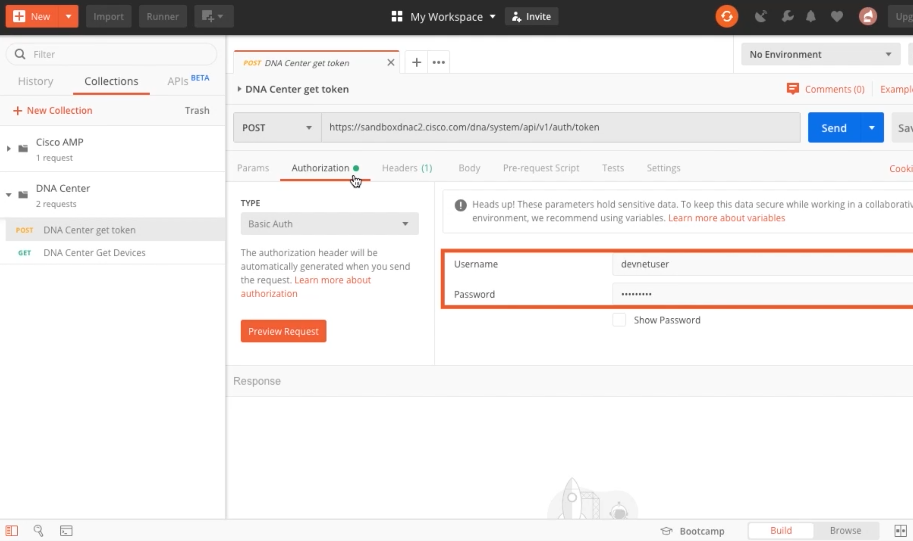
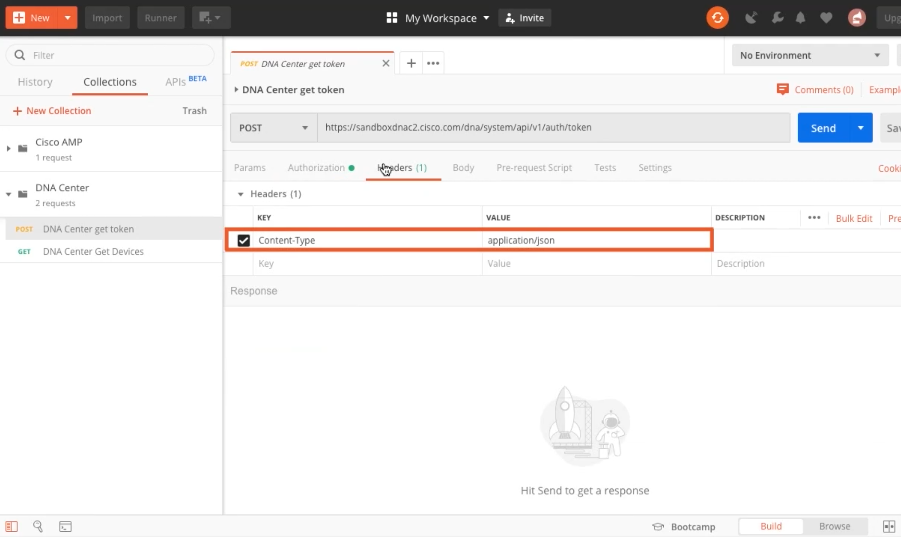
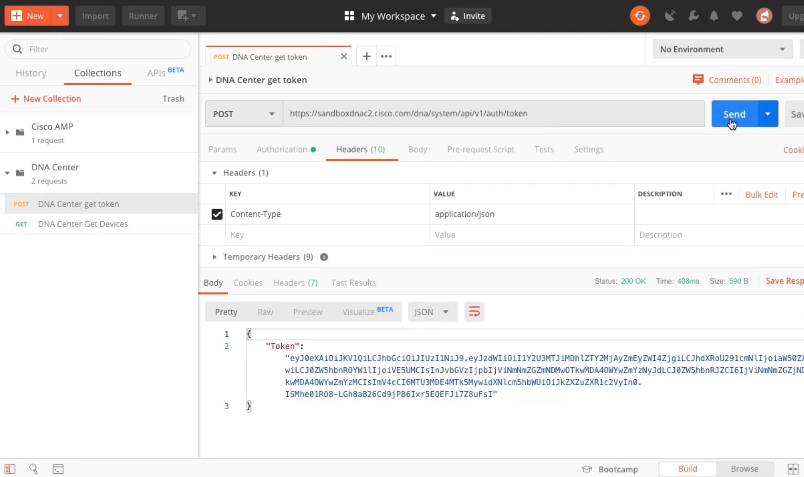
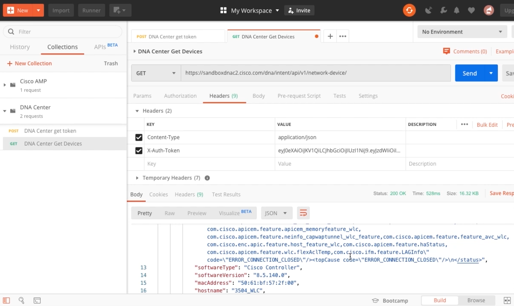
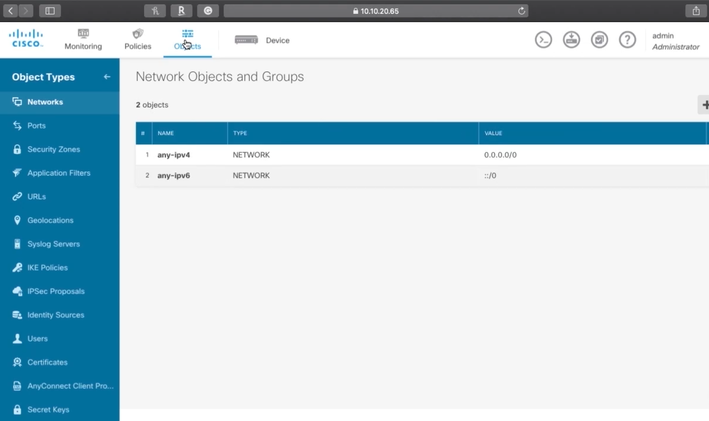

# 4. Explaining and Interpreting APIs

## HTTP Basics & APIs

### HTTP Communication

* HTTP GET \(show data\)
* HTTP POST \(create data\)
* HTTP PUT \(modify data\)
* HTTP Delete \(delete data\)

**Contents of HTTP:**

* Headers contain metadata
  * Authentication
  * Payload formatting
* Body
  * XML
  * JSON

### HTTP Codes

* 100 Informational
* 200 Success
* 300 Redirection
* 400 Client Error
* 500 Server Error

### API

Application Programming Interface \(Set of specific operations that are built for the standardized management of a system\)

**RESTful API:**

* Architectual Style
* Stateless
* Works nicely with HTTP

## Northbound and Southbound APIs

### Software Defined Networking

* Network controlled by applications
* Automatic provisioning and optimizing

**Three types of devices:**

* Controller \(talk with other devices \(south\) & applications \(north\)\)
* Devices \(south-bound communication\)
* Application \(north-bound communication\)

## Using DNA Center APIs to Provision, Optimize, Monitor & Troubleshoot

### DNA Center

Digital Network Architecture Centre

* Quickly provision and administer devices \(also using plug and play\)
* Health of network
* Deploy new devices and create new fabrics









## Using Python to Connect to Firepower's API

* Use python to interact with FTD APIs
* Using Cisco DevNet sandbox
* Use a script that Cisco created

`simple_client.py` to interact with FTD:

```python
import requests
import json
from bravado.client import SwaggerClient
from bravado.requests_client import RequestsClient
import warnings
import time

class FTDClient:
  headers = {
      "Content-Type": "application/json",
      "Accept": "application/json"
  }

  def __init__(self, address='192.168.1.1', port=443, username="admin", password="Admin123"):
    self.server_address = address
    self.server_port = port
    self.username = username
    self.password = password

    requests.package.urllib3.disable_warnings()
    warnings.filterwarnings('ignore', 'config also_return_response is not a recognised config')

    self.access_token = None
    self.bravado_client = None

  def login(self):
      payload = '{{"grant_type": "password", "username": "{}", "password": "{}"}}'.format(self.u???)
      auth_headers = {**FTDClient.headers, 'Authorization': 'Bearer '}
      print ('Authentication Headers: %s', auth_headers)
      print ('Authentication Payload is: %s', payload)
      ourRequest = requests.post("https://{}:{}/api/fdm/v1/fdm/token".format(self.server_address???)
        data=payload, verify=False, headers=auth_headers
      if ourRequest.status_code == 400:
        raise Exception("Error logging in: {}".format(r.content))
      try:
        self.access_token = ourRequest.json()['access_token']
      except:
        raise

  def get_client(self):
    if self.bravado_client:
      return self.bravado_client

    http_client = RequestsClient()
    http_client.session.verify = False

    http_client.session.headers = {**FTDClient.headers, 'Authorization': 'Bearer {}'.format(self.access???)}

    self.bravado_client = SwaggerClient.from_url('https://{}:{}/apispec/ngfw.json'.format(self.server_???))
      http_client=http_client, config={'validate_responses': False,???
      })

    return self.bravado_client
```



Adding an object to firepower:

```python
from simple_client import FTDClient
client = FTDClient(address='10.10.20.65', port=443, username='admin', password='Cisco1234')
client.login()
client.access_token
bravClient = client.get_client()
NetworkObject = bravClient.get_model('NetworkObject')
APINetObject = NetworkObject(name='APITestObject', subType='HOST', value='1.1.1.1', type='networkobject')
bravClient.NetworkObject.addNetworkObject(body=APINetObject).result()
```


## Additional Phython API Scripts

Get users from Cisco ISE:

```python
import http.client
import base64
import ssl
import sys

host = sys.argv[1]
user = sys.argv[2]
password = sys.argv[3]

conn = http.client.HTTPSConnection("{}:9060".format(host), context=ssl.SSLContext(ssl.PROTOCOL_TLS???))

creds = str.encode(':'.join((user, password)))
encodedAuth = bytes.decode(base64.b64encode(creds))

headers = {
  'accept': "application/json"
  'authorization': " ".join(("Basic", encodedAuth)),
  'cache-control': "no-cache",

}

conn.request("GET", "/ers/config/internaluser", headers=headers)

res = conn.getresponse()
data = res.read()

print("Status: {}".format(res.status))
print("Header:\n{}".format(res.headers))
print("Body:\n{}".format(data.decode("utf-8")))
```

Print all event IDs in Cisco AMP:

```python
import requests

client_id = '4d69c78ac2db6644d0f2'
api_key = '72d0639c-56c2-4e5f-812f-54dbffd5a502'

event_id_url = "https://{}:{}@api.amp.cisco.com/v1/event_types".format(client_id,api_key)

response = requests.get(event_id_url)

event_ids = response.json()

print(event_ids)
```

